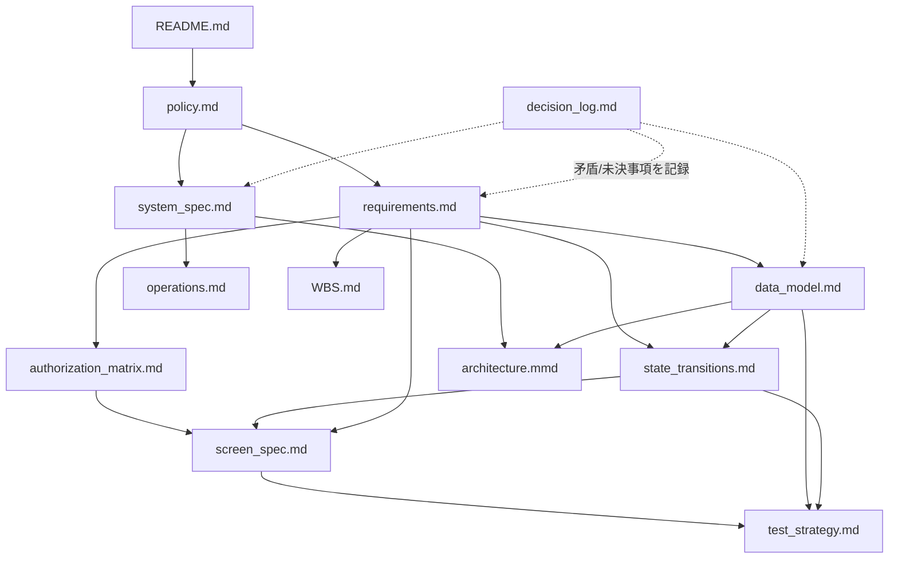

# basis/ ディレクトリについて

このディレクトリは `proposal/branch101`(シフト管理Webアプリケーション)の設計正本を格納する。
実装コードより先に存在し、実装中も継続的に更新される。

## 位置づけ

`proposal/branch101` はリポジトリ内の他の `proposal/branchN`(Milk Planet公開サイトのトップページデザイン比較案)とは
**目的もアーキテクチャも別物**である。branch1〜5は静的HTML/CSS/JSのデザイン比較用モックアップだが、
branch101は認証・DB・監査ログを持つ社内向け業務システムである。この違いと採用理由は
[decision_log.md](decision_log.md) の D-001 に記録している。

## 文書間の依存関係

## 読む順序(初見の場合)

1. `policy.md` — 何を大事にし、何をやらないか
2. `requirements.md` — 元指示書を正規化した要件一覧(REQ-ID)
3. `data_model.md` — 正本データと履歴の持ち方
4. `state_transitions.md` — ピリオド・提出・確定・公開の状態遷移
5. `authorization_matrix.md` — ロール×操作×スコープ
6. `system_spec.md` — 技術構成・実装制約・セキュリティ要件
7. `architecture.mmd` — モジュール構成図
8. `decision_log.md` — 採用判断・却下案・矛盾点の記録
9. `WBS.md` — 作業分解と完了条件
10. `screen_spec.md` / `test_strategy.md` / `operations.md` — 承認後に詳細化(現時点は骨子のみ)

## ステータス

Phase 0(設計)はユーザー承認済み。Phase 1〜5のコード実装、およびPhase 6のうち単体テストまで一通り完了
(`proposal/branch101/app/`)。ただし実データベース未接続・統合テスト/E2Eテスト未実装など、
「完成」と呼べる状態ではない。詳細は [WBS.md](WBS.md) の「実装状況サマリ」を参照。
